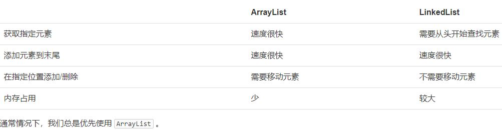

# Collection

## java.util
The Collection interface (java.util.Collection) and Map interface (java.util.Map) are the two main “root” interfaces of Java collection classes.

- List: The List interface in Java provide a way to store the ordered collection.
- Set: The set interface is present is java.util package and extends the Collection interface.
- Map: Key-value collection, Map Interface.  Java Map interface is not a subtype of the Collection interface.

## Iterator
An Iterator is an object that can be used to loop through collections, like ArrayList and HashSet. It is called an "iterator" because "iterating" is the technical term for looping.

## ArrayList
The ArrayList class is a resizable array, which can be found in the java.util package.
- boolean add(E e)
- boolean add(int index, E e)
- E remove(int index)
- boolean remove(Object e)
- E get(int index)
- int size()

## LinkedList
HEAD ──>│ A │ ●─┼──>│ B │ ●─┼──>│ C │ ●─┼──>│ D │   │  
The LinkedList stores its items in "containers." The list has a link to the first container and each container has a link to the next container in the list. To add an element to the list, the element is placed into a new container and that container is linked to one of the other containers in the list.  
Use an **ArrayList** for storing and accessing data, and LinkedList to manipulate data.

```java
public class Main {
    public static void main(String[] args) {
        List<String> list = new ArrayList<>();
        list.add("apple"); // size=1
        list.add("pear"); // size=2
        list.add("apple"); // 允许重复添加元素，size=3
        System.out.println(list.size());
    }
}
```
Create List directly
```java
List<Integer> list = List.of(1, 2, 5);
```
```java
import java.util.Iterator;
import java.util.List;
public class Main {
    public static void main(String[] args) {
        List<String> list = List.of("apple", "pear", "banana");
        for (Iterator<String> it = list.iterator(); it.hasNext(); ) {
            String s = it.next();
            System.out.println(s);
        }
    }
}
or
public class Main {
    public static void main(String[] args) {
        List<String> list = List.of("apple", "pear", "banana");
        for (String s : list) {
            System.out.println(s);
        }
    }
}
```
List to Array toArray(T[])
```java
public class Main {
    public static void main(String[] args) {
        List<Integer> list = List.of(12, 34, 56);
        Integer[] array = list.toArray(new Integer[3]);
        for (Integer n : array) {
            System.out.println(n);
        }
    }
}
```
Array to List List.of(T...)
```java
Integer[] array = { 1, 2, 3 };
List<Integer> list = List.of(array);
list.add(999); // UnsupportedOperationException List readOnly
```
## List methods
```java
import java.util.List;
public class Main {
    public static void main(String[] args) {
        List<String> list = List.of("A", "B", "C");
        System.out.println(list.contains("C")); // true
        System.out.println(list.contains("X")); // false
        System.out.println(list.indexOf("C")); // 2
        System.out.println(list.indexOf("X")); // -1
    }
}
```

## equals
Every instance in the List should overwrite equals method. String\Integer already implement equals
```java
import java.util.*;
public class Main {
	public static void main(String[] args) {
		        List<Person> list = List.of(
            new Person("Xiao", "Ming", 18),
            new Person("Xiao", "Hong", 25),
            new Person("Bob", "Smith", 20)
        );
        boolean exist = list.contains(new Person("Bob", "Smith", 20));
        System.out.println(exist ? "测试成功!" : "测试失败!");
	}
}
class Person {
    String firstName;
    String lastName;
    int age;
    public Person(String firstName, String lastName, int age) {
        this.firstName = firstName;
        this.lastName = lastName;
        this.age = age;
    }
    public boolean equals(Object o) {
        if (o instanceof Person) {
            Person p = (Person) o;
            return Objects.equals(this.firstName, p.firstName) && Objects.equals(this.lastName, p.lastName) && this.age == p.age;
        }
        return false;
    }
}
```

## Map
Map is Interface, The most common used class is HashMap.
遍历 interate
```java
import java.util.HashMap;
import java.util.Map;
public class Main {
    public static void main(String[] args) {
        Map<String, Integer> map = new HashMap<>();
        map.put("apple", 123);
        map.put("pear", 456);
        map.put("banana", 789);
        for (String key : map.keySet()) {
            Integer value = map.get(key);
            System.out.println(key + " = " + value);
        }
    }
}
```
```java
public class Main {
    public static void main(String[] args) {
        Map<String, Integer> map = new HashMap<>();
        map.put("apple", 123);
        map.put("pear", 456);
        map.put("banana", 789);
        for (Map.Entry<String, Integer> entry : map.entrySet()) {
            String key = entry.getKey();
            Integer value = entry.getValue();
            System.out.println(key + " = " + value);
        }
    }
}
```