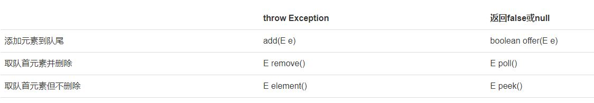
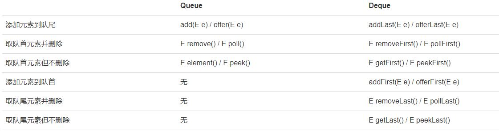

# Collection

## java.util
The Collection interface (java.util.Collection) and Map interface (java.util.Map) are the two main “root” interfaces of Java collection classes.

- List: The List interface in Java provide a way to store the ordered collection.
- Set: The set interface is present is java.util package and extends the Collection interface.
- Map: Key-value collection, Map Interface.  Java Map interface is not a subtype of the Collection interface.

## Iterator
An Iterator is an object that can be used to loop through collections, like ArrayList and HashSet. It is called an "iterator" because "iterating" is the technical term for looping.

## ArrayList
The ArrayList class is a resizable array, which can be found in the java.util package.
- boolean add(E e)
- boolean add(int index, E e)
- E remove(int index)
- boolean remove(Object e)
- E get(int index)
- int size()

## LinkedList
HEAD ──>│ A │ ●─┼──>│ B │ ●─┼──>│ C │ ●─┼──>│ D │   │  
The LinkedList stores its items in "containers." The list has a link to the first container and each container has a link to the next container in the list. To add an element to the list, the element is placed into a new container and that container is linked to one of the other containers in the list.  
Use an **ArrayList** for storing and accessing data, and LinkedList to manipulate data.

```java
public class Main {
    public static void main(String[] args) {
        List<String> list = new ArrayList<>();
        list.add("apple"); // size=1
        list.add("pear"); // size=2
        list.add("apple"); // 允许重复添加元素，size=3
        System.out.println(list.size());
    }
}
```
Create List directly
```java
List<Integer> list = List.of(1, 2, 5);
```
```java
import java.util.Iterator;
import java.util.List;
public class Main {
    public static void main(String[] args) {
        List<String> list = List.of("apple", "pear", "banana");
        for (Iterator<String> it = list.iterator(); it.hasNext(); ) {
            String s = it.next();
            System.out.println(s);
        }
    }
}
or
public class Main {
    public static void main(String[] args) {
        List<String> list = List.of("apple", "pear", "banana");
        for (String s : list) {
            System.out.println(s);
        }
    }
}
```
List to Array toArray(T[])
```java
public class Main {
    public static void main(String[] args) {
        List<Integer> list = List.of(12, 34, 56);
        Integer[] array = list.toArray(new Integer[3]);
        for (Integer n : array) {
            System.out.println(n);
        }
    }
}
```
Array to List List.of(T...)
```java
Integer[] array = { 1, 2, 3 };
List<Integer> list = List.of(array);
list.add(999); // UnsupportedOperationException List readOnly
```
## List methods
```java
import java.util.List;
public class Main {
    public static void main(String[] args) {
        List<String> list = List.of("A", "B", "C");
        System.out.println(list.contains("C")); // true
        System.out.println(list.contains("X")); // false
        System.out.println(list.indexOf("C")); // 2
        System.out.println(list.indexOf("X")); // -1
    }
}
```

## equals
Every instance in the List should overwrite equals method. String\Integer already implement equals
```java
import java.util.*;
public class Main {
	public static void main(String[] args) {
		        List<Person> list = List.of(
            new Person("Xiao", "Ming", 18),
            new Person("Xiao", "Hong", 25),
            new Person("Bob", "Smith", 20)
        );
        boolean exist = list.contains(new Person("Bob", "Smith", 20));
        System.out.println(exist ? "测试成功!" : "测试失败!");
	}
}
class Person {
    String firstName;
    String lastName;
    int age;
    public Person(String firstName, String lastName, int age) {
        this.firstName = firstName;
        this.lastName = lastName;
        this.age = age;
    }
    public boolean equals(Object o) {
        if (o instanceof Person) {
            Person p = (Person) o;
            return Objects.equals(this.firstName, p.firstName) && Objects.equals(this.lastName, p.lastName) && this.age == p.age;
        }
        return false;
    }
}
```

## Map
Map is Interface, The most common used class is HashMap.
遍历 interate
```java
import java.util.HashMap;
import java.util.Map;
public class Main {
    public static void main(String[] args) {
        Map<String, Integer> map = new HashMap<>();
        map.put("apple", 123);
        map.put("pear", 456);
        map.put("banana", 789);
        for (String key : map.keySet()) {
            Integer value = map.get(key);
            System.out.println(key + " = " + value);
        }
    }
}
```
```java
public class Main {
    public static void main(String[] args) {
        Map<String, Integer> map = new HashMap<>();
        map.put("apple", 123);
        map.put("pear", 456);
        map.put("banana", 789);
        for (Map.Entry<String, Integer> entry : map.entrySet()) {
            String key = entry.getKey();
            Integer value = entry.getValue();
            System.out.println(key + " = " + value);
        }
    }
}
```

## hash code
Simply put, hashCode() returns an integer value, generated by a hashing algorithm. Objects that are equal (according to their equals()) must return the same hash code. **Different objects do not need to return different hash codes.**

## EnumMap
key is Enum
```java
import java.time.DayOfWeek;
import java.util.*;
public class Main {
    public static void main(String[] args) {
        Map<DayOfWeek, String> map = new EnumMap<>(DayOfWeek.class);
        map.put(DayOfWeek.MONDAY, "星期一");
        map.put(DayOfWeek.TUESDAY, "星期二");
        map.put(DayOfWeek.WEDNESDAY, "星期三");
        map.put(DayOfWeek.THURSDAY, "星期四");
        map.put(DayOfWeek.FRIDAY, "星期五");
        map.put(DayOfWeek.SATURDAY, "星期六");
        map.put(DayOfWeek.SUNDAY, "星期日");
        System.out.println(map);
        System.out.println(map.get(DayOfWeek.MONDAY));
    }
}
```

## TreeMap
Map <-- SortedMap <-- TreeMap
SortedMap is interface. TreeMap is implemented class. sorted trees
Key must implemented Comparable interface. ( string and interger already inplemented)
```java
import java.util.*;
public class Main {
    public static void main(String[] args) {
        Map<Person, Integer> map = new TreeMap<>(new Comparator<Person>() {
            public int compare(Person p1, Person p2) {
                return p1.name.compareTo(p2.name);
            }
        });
        map.put(new Person("Tom"), 1);
        map.put(new Person("Bob"), 2);
        map.put(new Person("Lily"), 3);
        for (Person key : map.keySet()) {
            System.out.println(key);
        }
        // {Person: Bob}, {Person: Lily}, {Person: Tom}
        System.out.println(map.get(new Person("Bob"))); // 2
    }
}

class Person {
    public String name;
    Person(String name) {
        this.name = name;
    }
    public String toString() {
        return "{Person: " + name + "}";
    }
}
```

[java接口可以包含或存储值吗？](https://www.cnpython.com/java/1041425)
如果接口赋值，该值实现了该接口，就不会报错。

## Set
Store unrepeatable keys. (need to equals and hashcode) HashSet most common class
- boolean add(E e)
- boolean remove(Object e)
- boolean contains(Object e)

## Queue
First In First Out  
List - 在任意位置添加和删除元素  
Queue - 把元素添加到队列末尾；从队列头部取出元素  
- int size() 获取队列长度
- boolean add(E) / boolean offer(E) 添加元素到队尾
- E remove() / E poll() 获取队首元素并从队列中删除
- E element() / E peek() 获取队首元素但并不从队列中删除

```java
import java.util.LinkedList;
import java.util.Queue;
public class Main {
    public static void main(String[] args) {
        Queue<String> q = new LinkedList<>();
        // LinkedList即实现了List接口，又实现了Queue接口 
        // 在使用的时候，如果我们把它当作List，就获取List的引用，如果我们把它当作Queue，就获取Queue的引用：
        // 添加3个元素到队列:
        q.offer("apple");
        q.offer("pear");
        q.offer("banana");
        // 从队列取出元素:
        System.out.println(q.poll()); // apple
        System.out.println(q.poll()); // pear
        System.out.println(q.poll()); // banana
        System.out.println(q.poll()); // null,因为队列是空的
    }
}
```

## priorityQueue
PriorityQueue和Queue的区别在于，它的出队顺序与元素的优先级有关，对PriorityQueue调用remove()或poll()方法，返回的总是优先级最高的元素。
```java
import java.util.PriorityQueue;
import java.util.Queue;
public class Main {
    public static void main(String[] args) {
        Queue<String> q = new PriorityQueue<>();
        // 添加3个元素到队列:
        q.offer("apple");
        q.offer("pear");
        q.offer("banana");
        System.out.println(q.poll()); // apple
        System.out.println(q.poll()); // banana
        System.out.println(q.poll()); // pear
        System.out.println(q.poll()); // null,因为队列为空
    }
}
```
放入PriorityQueue的元素，必须实现Comparable接口，PriorityQueue会根据元素的排序顺序决定出队的优先级.

## Deque Double Ended Queue
既可以添加到队尾，也可以添加到队首； 既可以从队首获取，又可以从队尾获取。

```java
import java.util.Deque;
import java.util.LinkedList;
public class Main {
    public static void main(String[] args) {
        Deque<String> deque = new LinkedList<>();
        deque.offerLast("A"); // A
        deque.offerLast("B"); // A <- B
        deque.offerFirst("C"); // C <- A <- B
        System.out.println(deque.pollFirst()); // C, 剩下A <- B
        System.out.println(deque.pollLast()); // B, 剩下A
        System.out.println(deque.pollFirst()); // A
        System.out.println(deque.pollFirst()); // null
    }
}
```
我们发现LinkedList真是一个全能选手，它即是List，又是Queue，还是Deque。但是我们在使用的时候，总是用特定的接口来引用它，这是因为持有接口说明代码的抽象层次更高，而且接口本身定义的方法代表了特定的用途。
```java
// 不推荐的写法:
LinkedList<String> d1 = new LinkedList<>();
d1.offerLast("z");
// 推荐的写法：
Deque<String> d2 = new LinkedList<>();
d2.offerLast("z");
```
可见面向抽象编程的一个原则就是：尽量持有接口，而不是具体的实现类。

## Stack
LIFO Last In First Out
在Java中，我们用Deque可以实现Stack的功能：
- 把元素压栈：push(E)/addFirst(E)；
- 把栈顶的元素“弹出”：pop()/removeFirst()；
- 取栈顶元素但不弹出：peek()/peekFirst()。  
(当我们把Deque作为Stack使用时，注意只调用push()/pop()/peek()方法)
